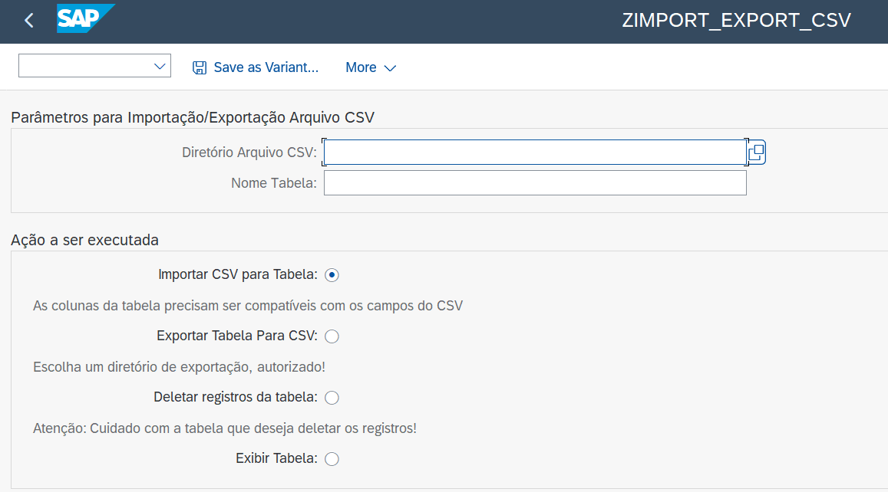
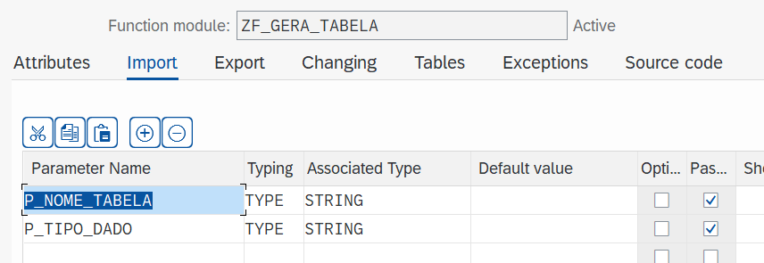
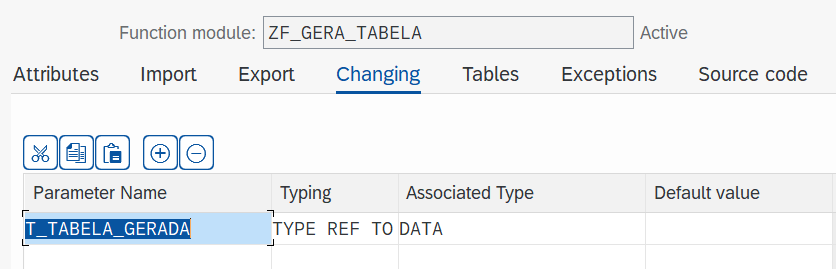
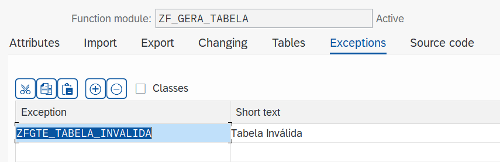
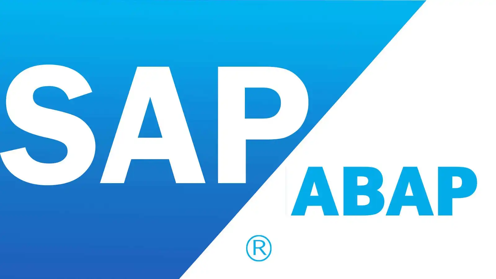

<h1 align="center"> abap_import_export_csv </h1>

## :memo: Descrição
Programa ABAP que permite importar ou exportar arquivos CSV facilmente. Um grande diferencial é a capacidade de identificar a tabela apenas digitando seu nome em uma caixa de texto na tela de seleção. O que torna o programa muito mais versátil.

## 📷 Preview

<a href="https://youtu.be/hZGbBWXTuTE">Vídeo de Demonstração do abap_import_export_csv</a>

## :books: Funcionalidades
* Importar arquivo CSV para tabela.
* Exportar tabela para arquivo CSV.
* Deletar todos os registros de uma tabela através do nome.
* Exibir ALV de uma tabela através do nome.

## :rocket: Rodando o projeto
<a href="https://github.com/argelcapela/abap_import_export_csv">Código Fonte no Github: abap_import_export_csv</a>
1) Acesse a transação SE38, crie um programa chamado zimport_export_csv e copie o código fonte do programa.
2) Ainda na SE38, editando o programa criado anteriormente, acesse os elementos de texto do programa. Copie e cole os elementos de texto 1 e 2, nas seções de text elements e selection texts.
3) Acesse a transação SE37, crie uma função chamada zf_gera_tabela e copie o código fonte da função. (É necessário criar um grupo de função antes de criar uma função, para isso acesse a transação SE80 e crie o grupo.)
 
<b>Configurando Import, Changing e Exceptions na SE37:</b> 

4) Depois que tudo for criado, ative o programa, função e grupo de função. Depois execute e seja feliz. 🙏😁

## :wrench: Tecnologias utilizadas

 
    

## 🧑‍🏫 Aprendizados
* Trabalhar com estruturas e tabelas dinâmicas
* Trabalhar com Field Symbols ("Ponteiros")
* Entender de modo mais profundo as funções no ABAP

## :handshake: Colaboradores
<table>
  <tr>
    <td align="center">
      <a href="http://github.com/argelcapela">
         
        
          <b>Argel Capela</b>
        
      </a>
    </td>
  </tr>
</table>

## :dart: Status do projeto
* Concluído em versão 1.0

## 🦟 Erros/Feedback
Identificou algum erro ou tem alguma sugestão? Por favor me informe, fico feliz em seguir aprendendo mais e melhorando.

## 🔐 Licença
<a href="LICENSE">MIT, Copyright (c) 2024 Argel Capela</a>
